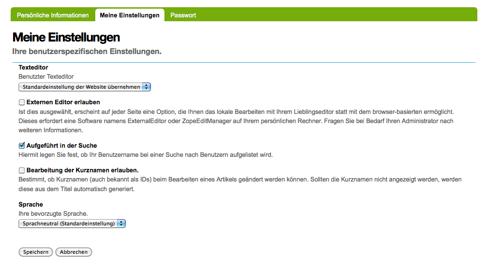

Meine Einstellungen
===================

Hier können Sie Einstellungen vornehmen, die das Verhalten der Plone-Website für Sie ändert und Ihr Profil beeinflusst.

|Meine Einstellungen|

Vor- und Nachname
 Geben Sie hier Ihren vollständigen Namen an
E-Mail
 Geben Sie hier Ihre gültige E-Mail-Adresse ein. An diese E-Mail-Adresse werden auch die Informationen gesendet, die Ihnen jemand aus dem Formular des persönlichen Profils sendet.
Ort
 Stadt und Land, in dem Sie wohnen oder arbeiten.
Sprache
 Ihre Muttersprache.
Biografie
 Eine kurze Beschreibung Ihrer Person für Ihr öffentlich zugängliches Profil.
Homepage
 Sofern vorhanden die URL Ihrer externen Homepage.
Texteditor
 Wählen Sie den Editor, den Sie zum Editieren der Artikel verwenden möchten.

 **Achtung:** Die meisten WYSIWYG-Editoren stellen bestimmte Anforderungen an den Browser.

Externen Editor erlauben
 Ist dies ausgewählt, erscheint ein Icon auf jeder Seite, welches das lokale Bearbeiten mit Ihrem Lieblingseditor ermöglicht, anstatt den im Browser integrierten Editor zu benutzen. Dieses erfordert eine Software namens *ExternalEditor* auf Ihrem Rechner. Fragen Sie Ihren Administrator nach weiteren Informationen.
Auflistungsstatus
 Wählen Sie dies aus, wenn Sie bei einer Benutzersuche aufgelistet werden wollen.
Porträt
 Um ein neues Porträt hinzuzufügen, klicken Sie einfach die *Durchsuchen*-Taste und wählen ein Bild von sich selbst zum Hochladen. Die empfohlene Größe ist 75 Pixel breit und 100 Pixel hoch.

