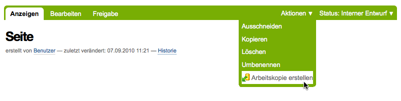
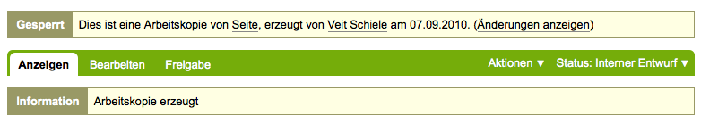
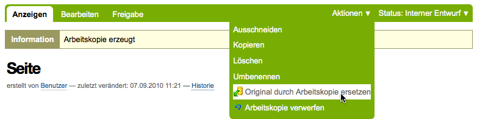
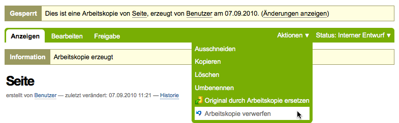
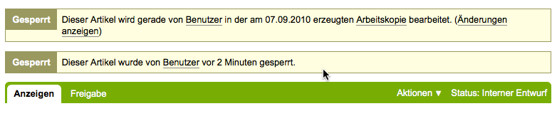
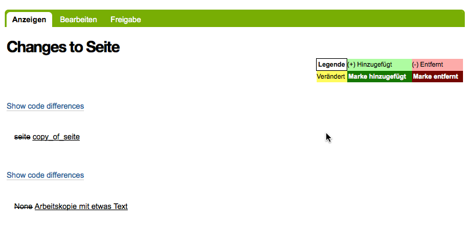

=============
Arbeitskopien
=============

Sofern *Working Copy Support* installiert ist, können Sie bei Bedarf eine Arbeitskopie des Dokuments erstellen.

Dies kann sinnvoll sein, wenn Sie ein bereits veröffentlichtes Dokument überarbeiten wollen. So kann die alte Version veröffentlicht bleiben bis Sie die neue fertig gestellt haben.

Diese Option finden Sie im Aktionsmenü des Artikels:

Beim Auswählen dieses Menüeintrags wird eine Kopie des Artikels erstellt, in dem Sie weiterarbeiten können.

Nachdem Sie die neue Version des Artikels fertiggesellt haben, können Sie das Original durch die Arbeitskopie ersetzen.

Sollten Sie ihre neue Version des Artikels doch nicht mehr benötigen, können Sie die Arbeitskopie verwerfen, d.h. die Arbeitskopie wird einfach gelöscht ohne das Orginal zu ersetzen.

Während eine Arbeitskopie besteht, ist das Orginial nicht veränderbar und zur Bearbeitung gesperrt um Überschneidungen zu verhindern. Wer das Orginal bearbeiten möchte, bekommt diese Mitteilung:

Die vorgenommenen Änderungen können Sie sich jederzeit anzeigen lassen, die Anzeige sieht dann beispielsweise so aus:

