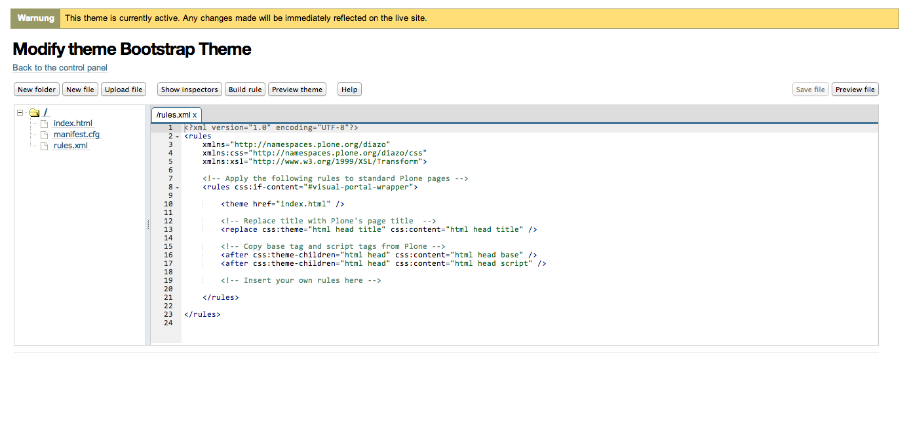
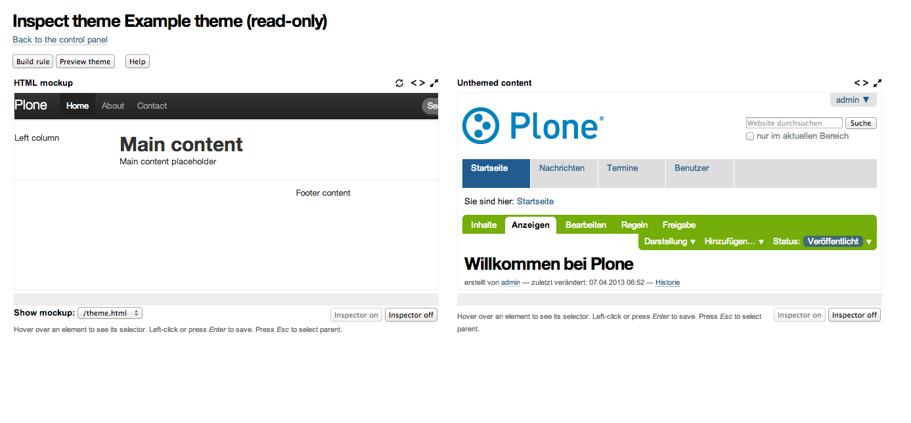

Theme-Settings
==============

Sie können im Theme-Settings-Kontrollfeld ein neues Diazo-Theme erstellen,
hochladen oder ein existierendes Theme aus einer Liste auswählen. Darüberhinaus
erhalten Sie eine umfangreiche Hilfe zum Theming mit Diazo.

Theme modifizieren
------------------

Sofern Sie ein neues Theme erstellt haben, erhalten Sie die Ansicht des `ACE
Code Editor <http://ajaxorg.github.io/ace/>`_:

Initial werden die folgenden Dateien erstellt:

- ``index.html``
- ``manifest.cfg``
- ``rules.xml``

Theme untersuchen
-----------------

In der Ansicht zum Untersuchen eines Themes erhalten Sie auch einen visuellen
Editor zum Erstellen von Regeln. Alternativ können Sie die Regeln auch über die
Auswahl der Tags im Quelltext erstellen.

