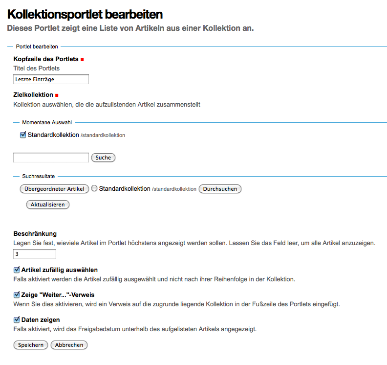

==================
Kollektionsportlet
==================

Dieses Portlet zeigt eine Liste von Artikeln an, die in einer Kollektion zusammengesammelt wurden.

|Kollektionsportlet|

Kopfzeile des Portlets
 Erforderlich Angabe des Titels des Portlets
Zielkollektion
 Erforderliche Angabe der Kollektion, die die aufzulistenden Artikel zusammengesammelt.
Beschränkung
 Anzahl der Artikel, die im Portlet höchstens angezeigt werden sollen.

 Wenn Sie sich alle Artikel anzeigen lassen möchten, Lassen Sie das Feld leer.

Artikel zufällig auswählen
 Falls aktiviert werden die Artikel zufällig ausgewählt und nicht nach ihrer Reihenfolge in der Kollektion.
Zeige "Weiter..."-Verweis
 Falls aktiviert, wird ein Verweis auf die zugrunde liegende Kollektion in der Fußzeile des Portlets angezeigt.
Daten zeigen
 Falls aktiviert, wird das Freigabedatum unterhalb des aufgelisteten Artikels angegezeigt.

