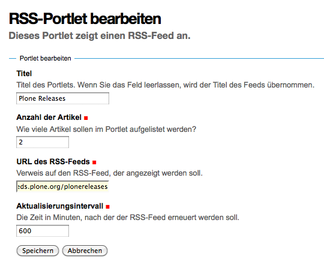

===========
RSS-Portlet
===========

Mit RSS-Feeds lassen sich Inhalte von Websites abonnieren. Wollen Sie verschiedene Quellen abonnieren, müssen Sie für jede dieser Quellen ein eigenes RSS-Portlet anlegen.

|RSS-Portlet|

Titel
 Titel des Portlets.

 Wird das Feld leergelassen, wird der Titel des Feeds übernommen.

Anzahl der Artikel
 Erforderliche Angabe für die Anzahl der Artikel, die in diesem Portlet aufgelistet werden sollen.
URL des RSS-Feeds
 Erforderliche Angabe, die auf den RSS-Feed verweist, der angezeigt werden soll.
Aktualisierungsintervall
 Erforderlich Angabe in Minuten, nach der der RSS-Feed aktualisiert werden soll.

