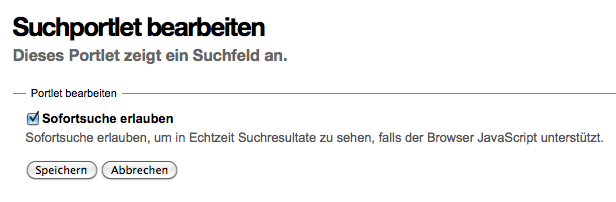

===========
Suchportlet
===========

Das Suchportlet erlaubt das Durchsuchen der Website.

|Suchportlet|

Sofortsuche erlauben
 Diese Sofortsuche ermöglicht, in Echtzeit die Suchergebnisse zu sehen sofern Ihr Browser JavaScript unterstützt.

 Dieses Portlet ist vor allem dann sinnvoll, wenn in der allgemeinen Suche die Sofortsuche nicht verfügbar ist.

