======
WebDAV
======

Sie können auf Ihren Zope-Server auch per WebDAV zugreifen um  Ihre Inhalte
einfacher Verwalten zu können.

Was ist WebDAV?
---------------

`WebDAV`_ ist eine Erweiterung des HTTP-Protokolls, die in `RFC 2518`_ definiert
ist.

WebDav ermöglicht das gemeinsame Arbeiten an Web-Inhalten. Während Sie eine
Datei editieren, können andere nicht schreibend auf diese Datei zugreifen.

Darüberhinaus müssen Sie die Daten nicht über einen Web-Browser editieren
sondern können Ihren bevorzugten Editor verwenden.

Zudem eignet sich WebDAV auch hervorragend zur Verwaltung von großen
Datenmengen.

Testen Sie WebDAV
-----------------

Sie können mit einem WebDAV-Client auf unsere Demo-Site zugreifen. Beachten Sie
bitte, dass Sie auf die oberste Ebene zwar lesend, nicht jedoch schreibend
zugreifen dürfen. Eigene Dateien können Sie im Verzeichnis ``/Members/autor``
hochladen und ändern.

URL
 ``http://www.plone-demo.de``
Benutzername
 ``autor``
Passowrt
 ``demosite``

Rufen Sie die URL jedoch nicht in einem WebDAV-Client sondern in Ihrem
Web-Browser auf, so erhalten Sie folgende Fehlermeldung::

 Error Type
     AttributeError
 Error Value
     manage_FTPget

WebDAV in Windows
-----------------

Windows 7
`````````

#. Öffnen Sie das Ordnerfenster *Computer* und klicken Sie anschließend auf
   *Laufwerk einbinden*.
#. Klicken Sie anschließend auf *Verbindung  mit  einer  Website  herstellen,
   auf  der  Sie  Dokumente und Bilder speichern können.*
#. Geben Sie in den nun folgenden Dialogfenstern die Zugangsdaten für Ihren
   WebDAV-Server ein und klicken anschließend auf *Fertig stellen*.
#. Bei der erstmaligen Verbindung mit dem WebDAV-Server werden Sie nach dem
   Benutzernamen und Passwort gefragt. Anschließend öffnet sich der gewünschte
   WebDAV-Ordner und Sie können  wie  bei lokalen Laufwerken auf Ordner und
   Dateien zugreifen.

**Anmerkung:** Meldet Windows 7 beim Einrichten der WebDAV-Verbindung
*The folder name is not valid* obwohl Ihre Angaben richtig sind, so hilft Ihnen
eventuell der Beitrag in `Microsoft Hilfe und Support
<http://support.microsoft.com/kb/928692/en>`_ weiter.

Webfolders in Windows XP und Windows 2003
`````````````````````````````````````````

Windows bringt mit XP und 2003 einen eigenen WebDAV-Client mit. Um ihn verwenden
zu können, müssen Sie zunächst jedoch folgende Schritte ausführen:

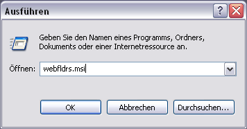

   Fenster *Ausführen*

#. Wählen Sie im *Start*-Menü *Ausführen…* und geben anschließend
   ``webfldrs.msi`` ein.

#. Klicken Sie auf *Select reinstall mode*.

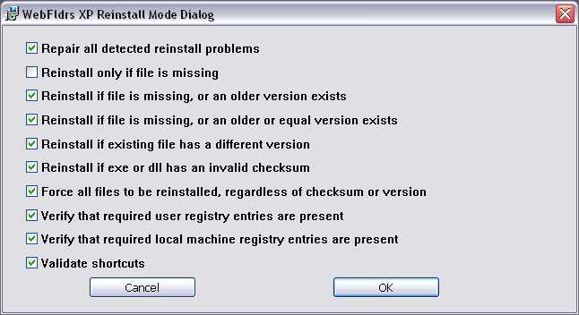

   Fenster WebFldrs XP Reinstall Mode Dialog

#. Wählen Sie alle Optionen aus bis auf *Reinstall only if file is
   missing* und klicken Sie anschließend auf *OK*.

#. Klicken Sie auf *Reinstall*.

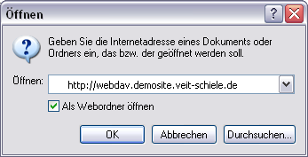

   Fenster WebFolders öffnen

Nachdem Sie Windows neu gestartet haben, können Sie z.B. im

Öffnen-Dialog des Internet Explorers angeben, dass die URL als Webordner
geöffnet werden soll.

Als ernsthafte Alternative lässt sich Novells *NetDrive* empfehlen. *NetDrive*
wird von Novell zusammen mit *iFolder* vertrieben, kann aber auch einzeln z.B.
vom Server der FH Hannover heruntergeladen werden: Download_.

NetDrive
````````
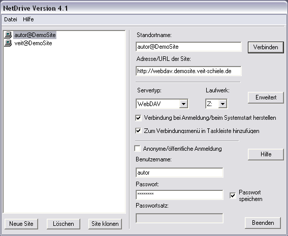

   Fenster NetDrive-Konfiguration

Ein WebDAV-Server kann einfach als Laufwerk eingebunden werden.

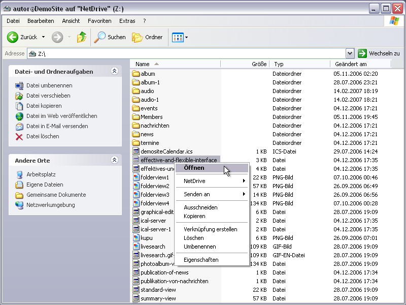

   Fenster NetDrive-Laufwerk

Anschließend verhält sich der WebDAV-Server wie ein ganz normales Laufwerk. Und
zum Editieren von Dateien können Sie jedes beliebige Programm verwenden.

Umgekehrt können aus den meisten Programmen die Dateien auch direkt auf dem
WebDAV-Server zurückgesichert werden.

NetDrive erlaubt Ihnen darüberhinaus, Dateien für andere zu sperren und wieder
freizugeben.

Enfold Desktop Client
`````````````````````

Mit `Enfolds Desktop Client`_ kann auf eine Plone-Site zugegriffen werden
sofern die Enfold-Server-Software installiert ist. Auf meine DemoSite darf mit
bis zu fünf dieser Clients zugegriffen werden.

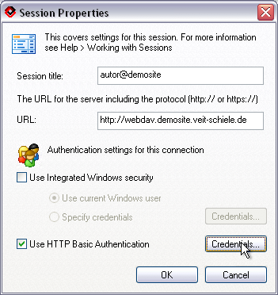

   Fenster Enfold Session Properties

Nach der Installation können Sie im Enfold Desktop Client einfach eine neue
Session definieren. In den *Authencation settings* können Sie sowohl *Windows
Security* (single-sign on, NTLM) als auch *HTTP Basic Authentication* wählen.
Falls Sie sich z.B. auf meiner Demosite anmelden möchten, deaktivieren Sie
*Windows Security* und geben den Nutzernamen ``autor`` und das Passwort
``demosite`` in den *Credentials* der *HTTP Basic Authentication* ein.

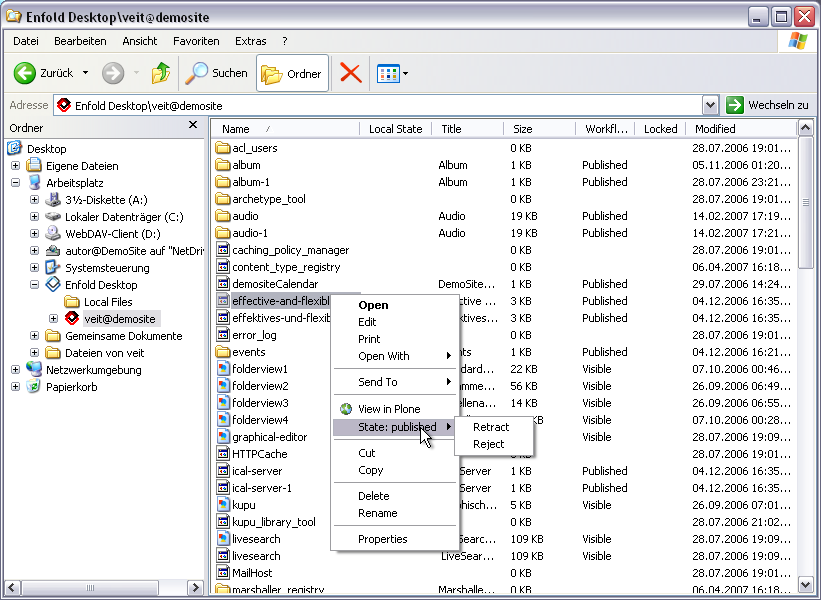

   Fenster Enfold Popup

Anschließend können Sie ein Objekt der Plone-Site mit dem Editor
Ihrer Wahl bearbeiten und darüberhinaus auch dessen Status und Eigenschaften
verändern.

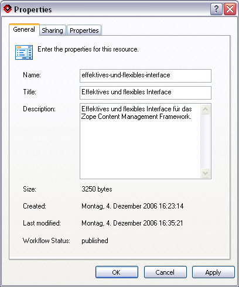

   Fenster Enfold Properties

Wenn Sie im Popup-Menü die Properties eines Objekts öffnen, können Sie unter
anderem ID, Titel, Beschreibung, Zugangsrechte und Eigenschaften ändern.

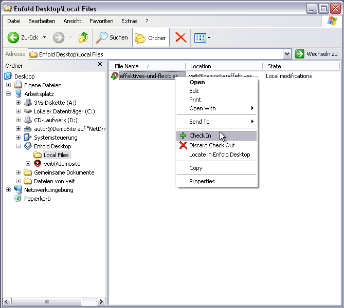

   Fenster Enfold für Offline-Bearbeitung

Mit dem Enfold Desktop Client können Dateien auch offline bearbeitet werden.
Wenn sie die Daten später mit dem Server abgleichen überprüft der Client, ob
Konflikte durch Änderungen anderer Nutzer entstanden sind und informiert Sie
darüber.

Schließlich normalisiert der Enfold Desktop Client auch alle Dateinamen mit
Sonder- und Leerzeichen.

WebDAV in Mac OS X
------------------

Mac OS X bringt eine WebDAV-Unterstützung mit. Jedoch ist erst ab Version 10.4
auch der sichere Zugriff über ``https`` möglich.

Um sich mit einem WebDAV-Server zu verbinden, gehen Sie einfach im *Finder* in
das *Gehe zu*-Menü und dann zu *Mit Server verbinden...*

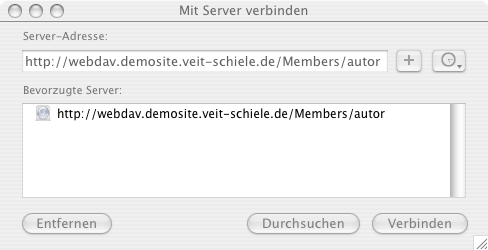

   Fenster *Mit Server verbinden*

Anschließend geben Sie die URL des WebDAV-Servers an und drücken auf ``+`` um
den Server als Favoriten zu speichern.

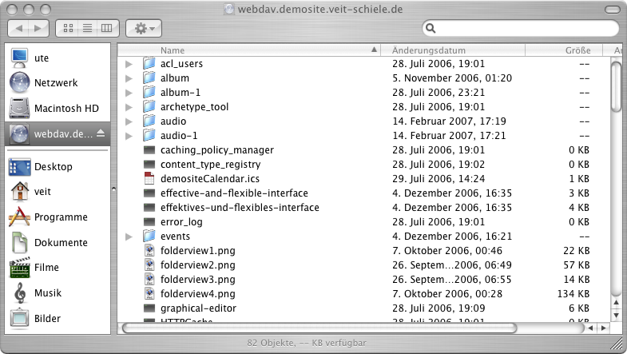

   Apple Terminal Fenster

Schließlich erscheint ein Fenster mit den Inhalten des WebDAV-Servers.

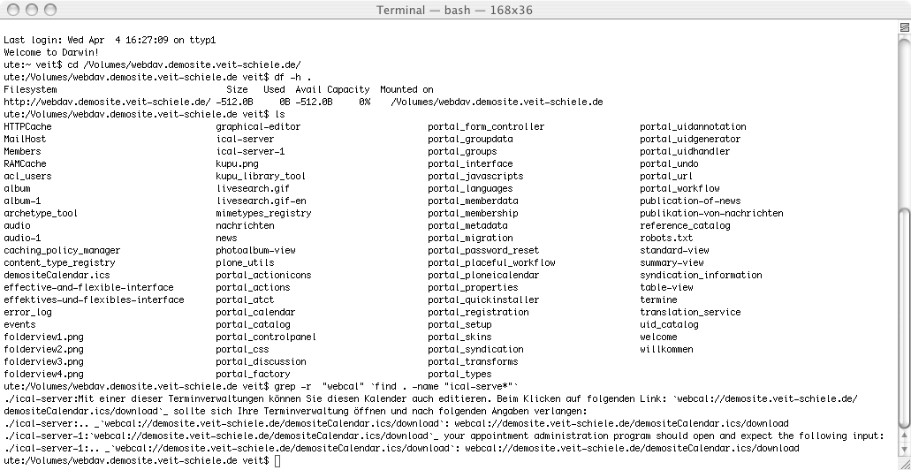

   Apple-Terminal

Mac OS X unterstützt die Einbindung von WebDAV-Servern als Laufwerke so
umfangreich, dass auch mit einer Shell darauf zugegriffen werden kann. Damit
kann z.B. auch ``find`` und ``grep`` verwendet werden. Dennoch führen manche
Kommandos, wie z.B. ``df``, zu merkwürdigen Ausgaben.

Falls Mac OS X versucht, ``.DS_Store``-Dateien in jedem Verzeichnis anzulegen,
können Sie mit folgender Angabe im Terminal das Erstellen auf allen entfernten
Servern unterbinden::

 defaults write com.apple.desktopservices DSDontWriteNetworkStores true

Anschließend sollte der Mac neu gestartet werden.

Um bereits angelegte Dateien oder Ordner wieder zu entfernen, können Sie im
Terminal in das WebDAV-Verzeichnis wechseln und anschließend folgendes Kommando
eingeben::

    $ find . \( -name .DS_Store -or -name .TemporaryItems -or -name .Trashes -or -name ._* \) -exec rm -rf "{}" \; -prune

WebDAV in Linux
---------------

Um in Linux einen WebDAV-Server als Laufwerk einzubinden müssen Zusatzprodukte
wie z.B. `davfs`_ verwendet werden.

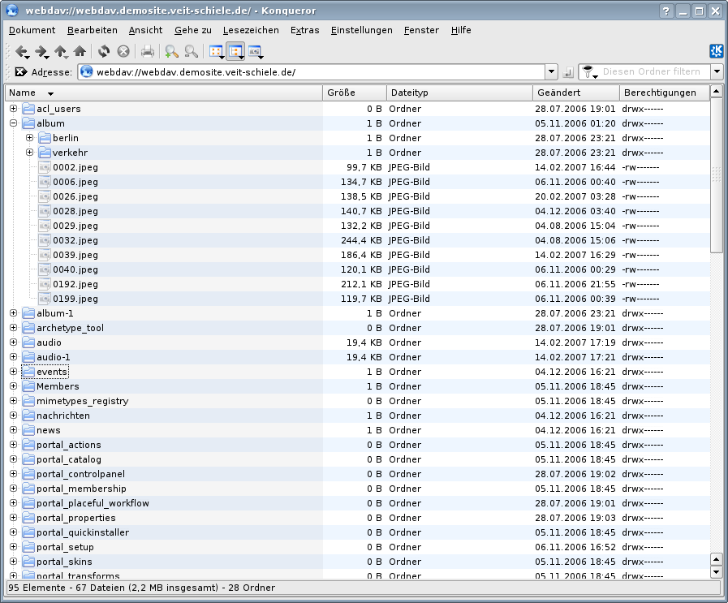

   Konqueror-Fenster

Konqueror zeigt das Dateisystem eines WebDAV-Servers an wenn die URL mit
``webdav://`` oder für HTTPS mit ``webdavs://`` beginnt.

Nautilus erlaubt die Verwendung normaler URLs mit ``http://``.

.. _`WebDAV`: http://www.webdav.org/
.. _`RFC 2518`: http://ftp.ics.uci.edu/pub/ietf/webdav/protocol/rfc2518.pdf
.. _Download: http://www.fh-hannover.de/fileadmin/media/doc/rz/netdrive.exe
.. _`Enfolds Desktop Client`: http://www.enfoldsystems.com/Files/setup-desktop-3.0.1-7071.exe
.. _`davfs`: http://sourceforge.net/projects/dav/
