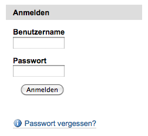
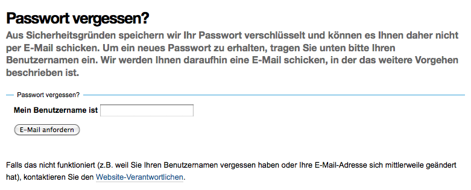
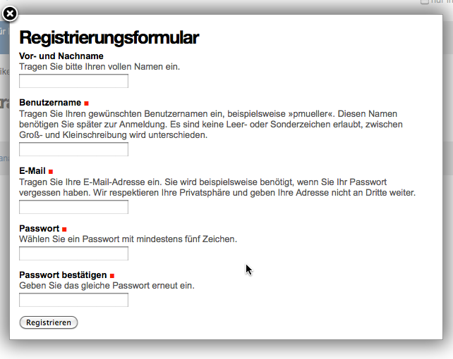

Anmelden
========

Jeder registrierte Nutzer kann durch einen eindeutigen Benutzernamen eindeutig identifiziert werden. Nachdem Sie sich mit Ihrem Benutzernamen und Passwort an der Website angemeldet haben, werden Ihnen neue Aktionen bereitgestellt wie eine persönliche Seite und ein eigener Ordner.

Um sich auf der Website anmelden zu können, müssen Sie bereits an der Website registriert sein. Dann können Sie sich mit Ihrem Benutzernamen und Passwort an der Website anmelden.  Hierfür gibt es zum einen das Anmeldeportlet, zum anderen den Link *Anmelden*. 

   Anmeldeportlet

Sowohl das Portlet als auch das Anmeldeformular enthalten Eingabefelder für *Benutzername* und *Passwort* sowie eine *Anmelden*-Taste. 

Passwort zusenden
-----------------

Darüberhinaus gibt es noch einen Verweis *Passwort vergessen?*, das zu einem weiteren Formular führt, mit dem sich Nutzer einen Link an Ihre zuvor eingegebene E-Mail-Adresse schicken lassen können um das Passwort neu zu setzen.

   Passwort vergessen?

Selbstregistrierung
-------------------

Wenn sich auf der Website neue Benutzer auch selbst registrieren dürfen, gibt es auch noch einen Link *Neuer Benutzer?*, der zur :doc:`../registrierung` führt. 

   Registrierung

