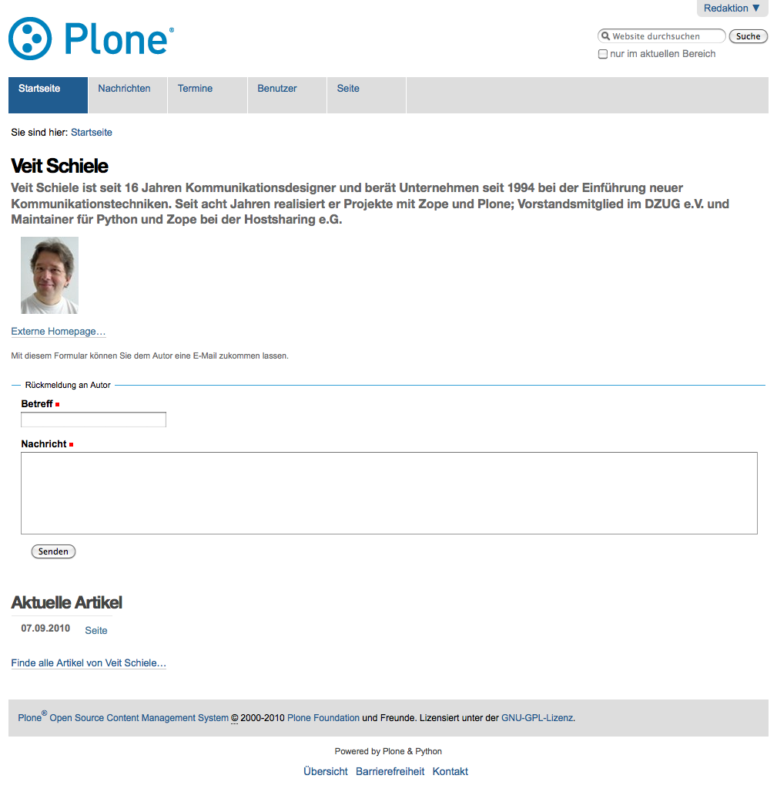

Profil
======

Ihr Profil gibt anderen Nutzern der Website Hinweise zu Ihrer Person und Ihren Tätigkeiten. Links auf Ihr Profil finden sich in den von Ihnen erstellten Artikeln und spezifischen Übersichtslisten. Sie selbst können Ihr Profil darüberhinaus über Ihre persönliche Seite erreichen.

|Profil|

Ihr Profil enthält folgende Informationen:

- Vor- und Nachname
- Standort und Muttersprache
- Biographie
- Homepage auf dieser Website…
- Portrait
- Rückmeldeformular
- Liste mit Links zu Ihren aktuellen Artikeln auf dieser Website wobei die Liste nach Art der Artikel sortiert ist.

Im Rückmeldeformular kann Ihnen ein Besucher eine Nachricht hinterlassen. Diese Nachricht wird an die E-Mail-Adresse geschickt, die Sie in Ihrem Profil angegeben haben.

