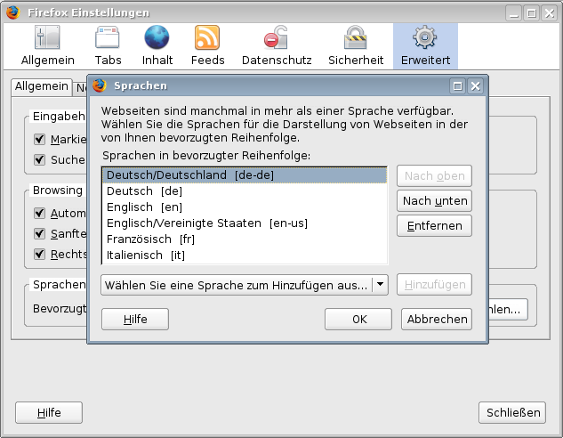

Sprachen
========

Websites sind häufig in mehr als einer Sprache verfügbar. Die Sprache, die Ihnen beim ersten Aufruf der Website angezeigt wird, ist abhängig von der in Ihren Browser-Einstellungen angegebenen Reihenfolge.

|Einstellungen - Sprachen|

Durch die Änderung der Sprache im Ansicht-Menü der Website wird die Einstellung des Browsers überschrieben.

