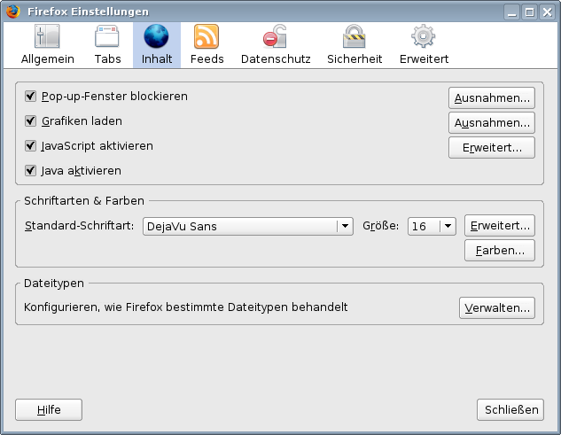

Textdarstellung
===============

|Browser - Schriftarten|

Schriftart
==========

In HTML-Dokumenten kann eine Schriftfamilie für einen bestimmten Text angegeben werden. Die konkrete Anzeige einer Website ist jedoch abhängig von den auf Ihrem Computer installierten Schriften. 

Schriftgröße
============

Die Schriftgröße wird bei HTML-Dokumenten meist in relativen Größen angegeben. Dies hat den Vorteil, dass der jeweilige Betrachter in *Ansicht: Schriftgrad* die Schriftgröße an die eigenen Bedürfnisse anpassen kann. Und selbst der Schriftgrad der 100%-Darstellung ist in einigen Browsern einstellbar:  z.B. lässt sich im Browser »Mozilla« in *Einstellungen: Erscheinungsbild: Schriftarten* die Schriftgröße in Pixeln angegeben.

