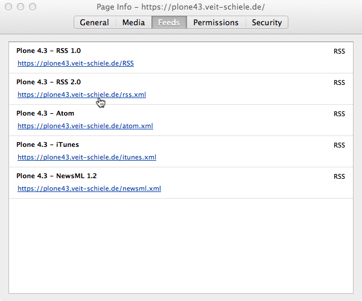
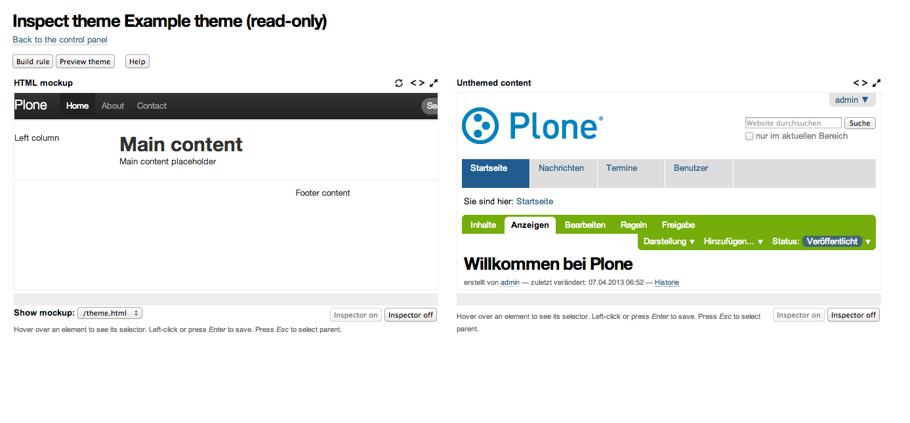
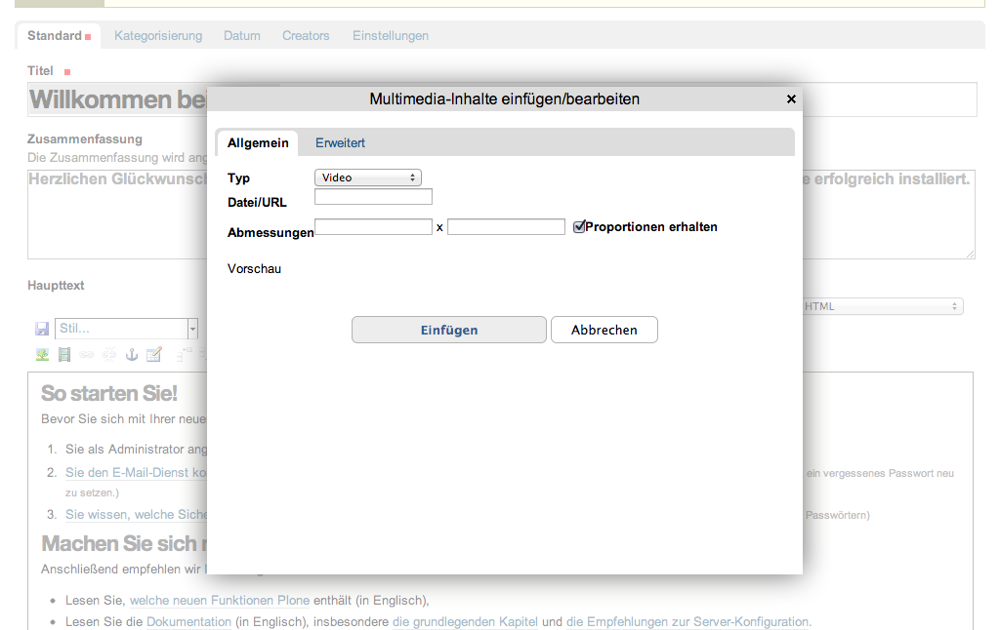
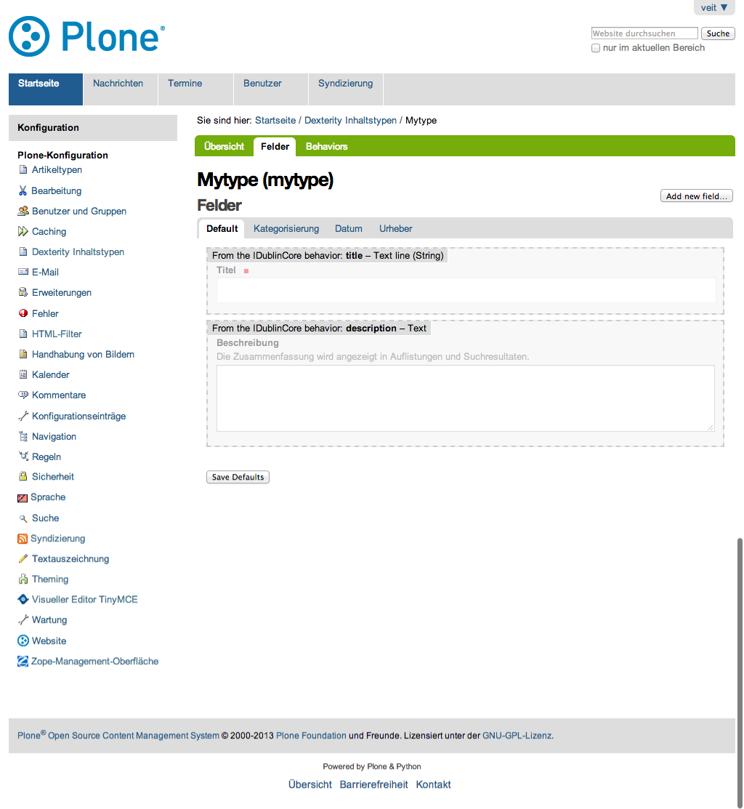

==========
Einleitung
==========

Dieses Benutzerhandbuch soll ein leicht verständliches Handbuch für die Nutzer unseres Publikationsservers sein. So wie der Server für die unterschiedlichen Interessen unserer Kunden angepasst werden kann, ist auch das Handbuch leicht diesen veränderten Bedingungen anzupassen.

Installation
------------

#. Die für die Installation erforderlichen Voraussetzungen sind beschrieben im Plone-Entwicklerhandbuch unter `Installation`_.
#. Auch die Installation ist dort beschrieben im Kapitel `Erstellen eines Buildout-Projekts`_.
 

Was ist neu in Plone 4.3
------------------------

Erweiterte Syndizierung
~~~~~~~~~~~~~~~~~~~~~~~

Plone stellt schon seit langer Zeit für Ordner und Kollektionen einen RSS-Feed
zum Abonnieren zur Verfügung. Mit der Version 4.3 sind nun noch weitere 
RSS-Formate hinzugekommen und zwar

- RSS 2.0
- Atom
- iTunes
- NewsML 1.2

So zeigt z.B. Firefox die verschiedenen Feeds in den Seiteninformationen an:

|Feeds|

Ein weiterer Vorteil von Plone 4.3 ist auch, dass die Feeds auch den Haupttext
eines Artikels ausliefern können. Damit können nun RSS-Feeds out-of-the-box
zur Verteilung der Inhalte auf anderen Websites verwendet werden. 

In-Plone Theme-Editor
~~~~~~~~~~~~~~~~~~~~~

Mit dem neuen In-Plone Theme Editor ist es möglich, völlig neue Diazo-Themes auf der Web-Oberfläche zu erstellen. Und selbstverständlich lassen sich mit
dem neuen Editor auch bestehende Themes anpassen.

|In-Plone Theme-Editor|

Aktualisierter WYSIWYG-Editor
~~~~~~~~~~~~~~~~~~~~~~~~~~~~~

Den WYSIWYG-Editor erhalten Autoren beim Erstellen und Ändern der Haupttexte
eines Artikels. Mit der neuen Version dieses Editors erhalten Sie

- verbesserte Unterstützung für den Internet Explorer
- verbesserte Performance
- bessere Unterstützung für Barrierearmut nach `WAI-ARIA
  <http://www.w3.org/WAI/intro/aria>`_
- bessere Unterstützung für `Dexterity
  <http://plone.org/products/dexterity>`_-Artikeltypen
- HTML5-Unterstützung z.B. zum Einbinden von externen Videos

|Videos einbinden|

Dexterity-Framework
~~~~~~~~~~~~~~~~~~~

Das Dexterity-Framework erleichtert die Erstellung neuer Artikeltypen:

|Dexterity-Felder|

Resümee
~~~~~~~

Diese vier Vorteile von Plone 4.3 sollten gute Gründe
sein, um Ihre Website zu aktualisieren. Darüberhinaus
ist Plone 4.3 ressourcenschonender da der WYSIWYG-Editor Kupu wegfiel und die kinetic style sheets (KSS) durch
`jQuery <http://jquery.com/>`_-Funktionen ersetzt wurden.
Wir haben auch bereits einige Erfahrungen mit der
Migration auf Plone 4.3 gesammelt und in unserem Plone-
Entwicklerhandbuch dokumentiert: `Update für Plone 4.3
<http://www.plone-entwicklerhandbuch.de/news/update-fuer-plone-4.3>`_.
 
Was ist neu im Plone-Nutzerhandbuch
-----------------------------------

Folgende Kapitel sind neu hinzugekommen:

- :doc:`konfiguration/theme-settings`

Weitere Handbücher
------------------

`Plone-Entwicklerhandbuch`_

.. _`Installation`: http://www.plone-entwicklerhandbuch.de/plone-entwicklerhandbuch/entwicklungsumgebung#installation
.. _`Erstellen eines Buildout-Projekts`: http://www.plone-entwicklerhandbuch.de/plone-entwicklerhandbuch/entwicklungsumgebung/erstellen-eines-buildout-projekts.html

.. _`Plone-Entwicklerhandbuch`: http://www.plone-entwicklerhandbuch.de

