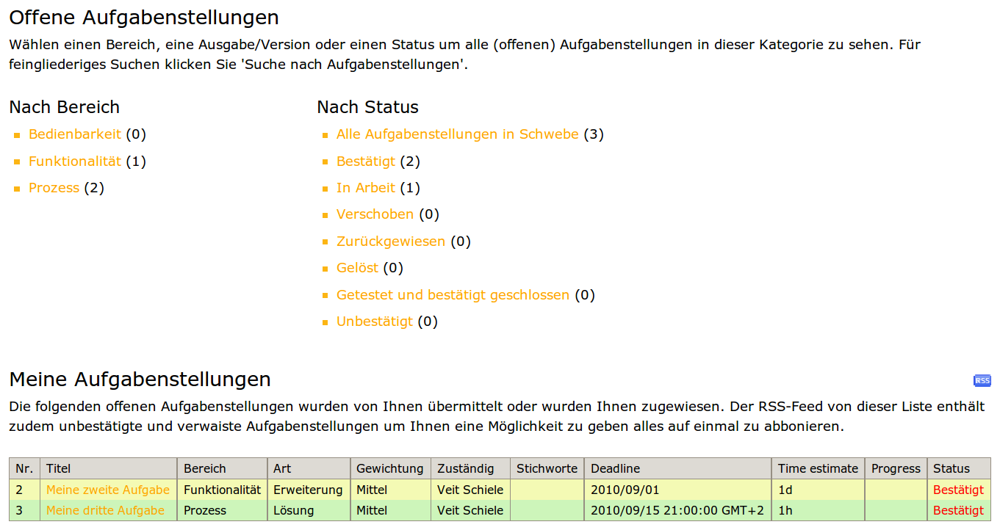

Erweiterte Funktionen in Poi
============================

Zeitmanagement
--------------

Jede Aufgabenstellung erhielt zusätzlich die folgenden beiden Felder:

- Feld *Abgeschlossen* mit den Werten 0–100% in 10%-Schritten.
- Feld *Geschätzte Zeit* in Tagen, Stunden und Minuten.

Daraus wird zusammen mit dem Feld *Ablaufdatum* eine Liste generiert, die nach Dringlichkeit sortiert. Sind zwei Problemstellungen gleichwertig, wird nach deren Priorisierung weiter unterschieden.

Gestalterisch lassen sich dabei folgende drei Stufen unterscheiden: 

- im Verzug
- heute zu beginnen
- im grünen Bereich

|Offene Aufgabenstellungen|

Dabei wird berücksichtigt, dass die Zeiten für einzelne Problemstellungen konkurrieren und sich die Dringlichkeiten kumulieren können.

Detailliertes Benachrichtigungssystem
-------------------------------------

In ``Products.Poi`` kann nun angegeben werden, ob 

- der Tracker-Manager über alle Änderungen informiert werden soll
- ob die Ersteller eines Eintrags über Änderungen an diesem Eintrag informiert werden sollen
- ob die für einen Eintrag zuständigen Bearbeiter über Änderungen informiert werden

Organisation
------------

- Für die verschiedenen Aufgabenbereiche können jeweils unterschiedliche Personen angegeben werden
- Probleme können auf Folgeaufgaben referenzieren.

