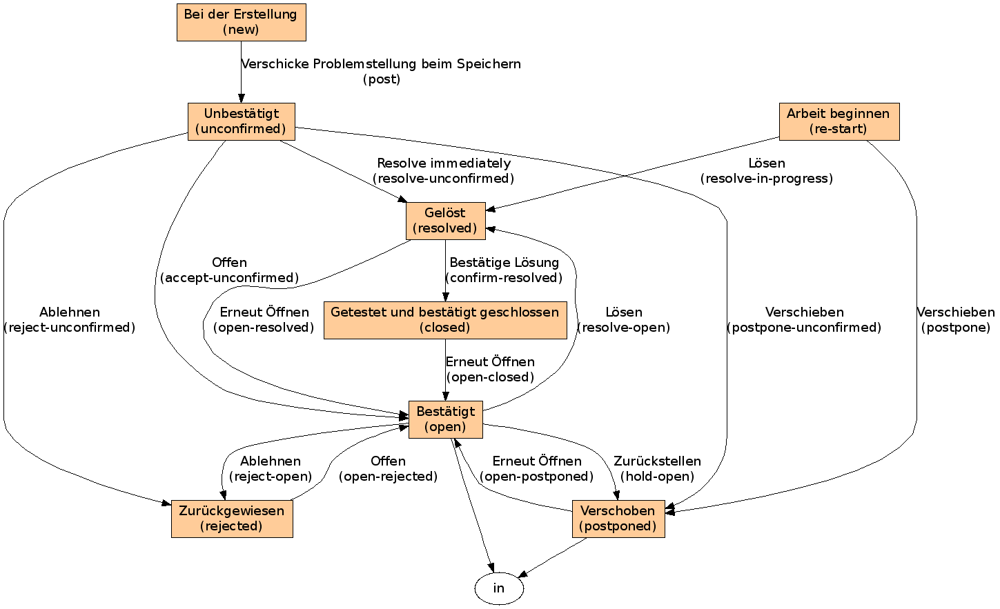

======================================
Stadien und Übergänge der Poi-Aufgaben
======================================

|Stadien und Übergänge einer Problemstellung|

Folgende Stadien und Übergänge sind für eine Aufgabe möglich:

Bei der Erstellung 

 - Verschicke Problemstellung beim Speichern

Unbestätigt

 - Ablehnen
 - Offen
 - Sofort gelöst
 - Verschieben

Bestätigt

 - Gelöst
 - Ablehnen
 - Zurückstellen

Arbeit beginnen

 - Verschieben
 - Gelöst

Gelöst

 - Lösung bestätigt
 - Erneut öffnen

Getestet und bestätigt geschlossen

 - Erneut öffnen

Verschoben

 - Erneut öffnen

Zurückgewiesen

 - Öffnen

