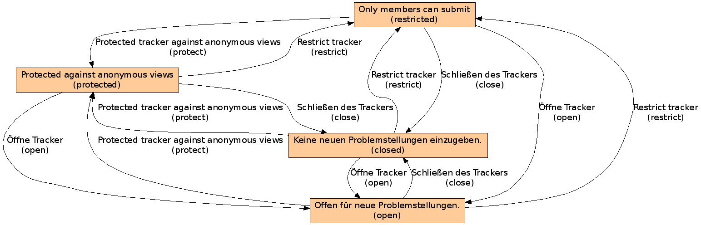

Stadien und Übergänge der Poi-Aufgabenverwaltung
================================================

|Stadien und Übergänge des Ticketsystems|

Durch diese Stadien lässt sich festlegen, wer Aufgaben sehen, bearbeiten oder erstellen darf. Im Einzelnen:

Offen für neue Problemstellungen (open)
 Auch nicht-angemeldete Nutzer können die Aufgaben sehen.
Only members can submit (restricted)
 Nicht-angemeldete Nutzer können die Aufgaben und Antworten sehen, jedoch nur angemeldete Nutzer können Problemstellungen hinzufügen.
Protected against anonymous views (protected)
 Nutzer der Rolle *Readers* können  lesen, *Editors* bearbeiten und *Contributors* hinzufügen wobei nicht-angemeldete Nutzer nichts zu sehen bekommen.
Keine neuen Problemstellungen einzugeben (closed)
 Es können keine neuen Problemstellungen mehr eingegeben werden.
 
