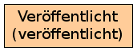
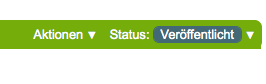

Arbeitsablauf mit einem Status
==============================

Ein Arbeitsablauf ohne Übergänge, alles ist sofort *veröffentlicht*.

|Arbeitsablauf mit einem Status|

Der eine Status ist:

#. Veröffentlicht

   Ein Arbeitsablauf, in dem der Status nicht geändert werden kann, sondern immer schon auf  *veröffentlicht* gesetzt ist.

   Der Unterschied zu keinem Arbeitsablauf ist der, dass Artikel mit diesem Arbeitsablauf auch von Portlets, Ansichten und Produkten die den Status *Veröffentlicht* erwarten, angezeigt werden.

