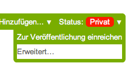
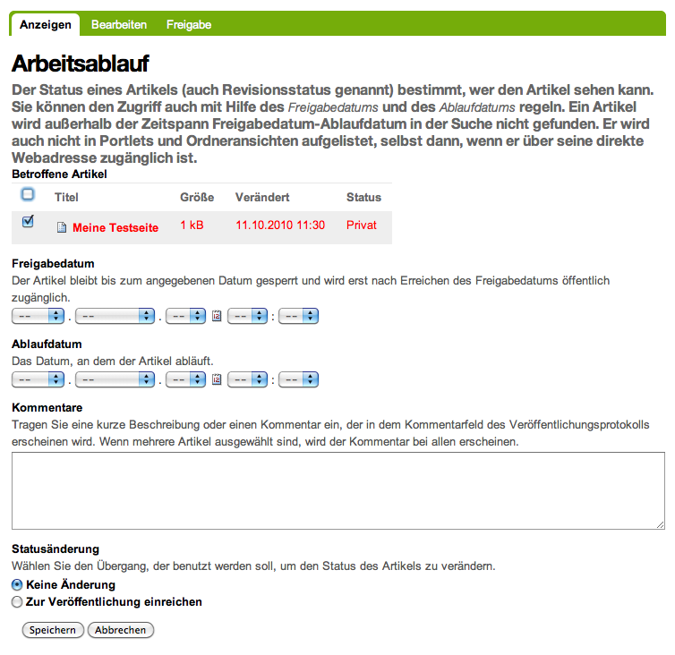
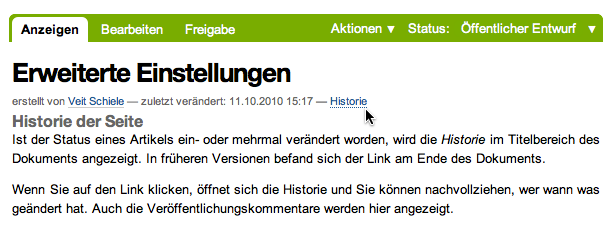
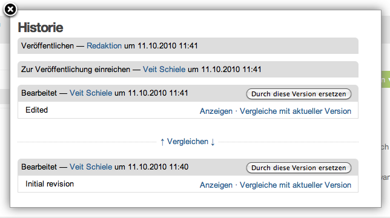
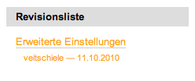
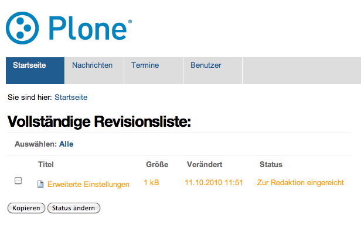

==============
Bedienelemente
==============

Statusmenü
----------

Erweitert…
``````````

Wenn Sie einen Artikel hinzugefügt haben, Artikel veröffentlichen oder verwalten dürfen, wird Ihnen im Statusmenü die Option *Erweitert…* angezeigt. 



Nach dem Anklicken öffnet sich das Formular *Arbeitsablauf*, in dem Sie verschiedene Angaben zu einer Statusänderung machen können.

Arbeitsablauf
-------------



Betroffene Artikel
 Der Status der angeklickten Artikel kann geändert werden.
Auf alle Artikel im Ordner anwenden
 Für einen Artikel, der andere Artikel enthalten kann, kann die Stautsänderung auch für alle darinliegenden Artikel übernommen werden.

 .. image:: plone4-statusmenue-erweitert-auf-alle-artikel-im-ordner-anwenden.png

Freigabedatum
 Datum, ab dem der Artikel öffentlich zugänglich sein soll. Ein Anwendungsfall dafür kann ein Artikel sein, der zu einem bestimmten Termin veröffentlicht aber vorher bereits verfasst werden soll.

 .. image:: plone4-statusmenue-erweitert-freigabedatum.png

Ablaufdatum
 Eine Veröffentlichung kann zu einem bestimmten Termin automatisch zurückgezogen werden.

 .. image:: plone4-statusmenue-erweitert-ablaufdatum.png

Kommentare
 Bemerkungen zur Veranlassung des Statuswechsels. Diese können später in der Historie des Dokuments nachgelesen werden (siehe weiter unten auf dieser Seite).

 .. image:: plone4-statusmenue-erweitert-kommentar-fuer-veroeffentlichungsprotokoll.png

Historie
--------

Ist der Status eines Artikels ein- oder mehrmal verändert worden, wird die *Historie* im Titelbereich des Dokuments angezeigt.



Wenn Sie auf das Plussymbol klicken, öffnet sich die Historie und Sie können nachvollziehen, wer wann was geändert hat. Auch die Veröffentlichungskommentare werden hier angezeigt.



Revisionsliste
--------------

Wenn Sie Artikel veröffentlichen dürfen, kann Ihnen bei vorhandenen zur Redaktion eingereichten Artikeln automatisch ein Portlet angezeigt werden, das eine Liste der zur Veröffentlichung eingereichten Dokumente anzeigt.



Sie können direkt einen dieser Artikel anklicken oder sich auch die gesamte Revisionsliste anzeigen lassen:



