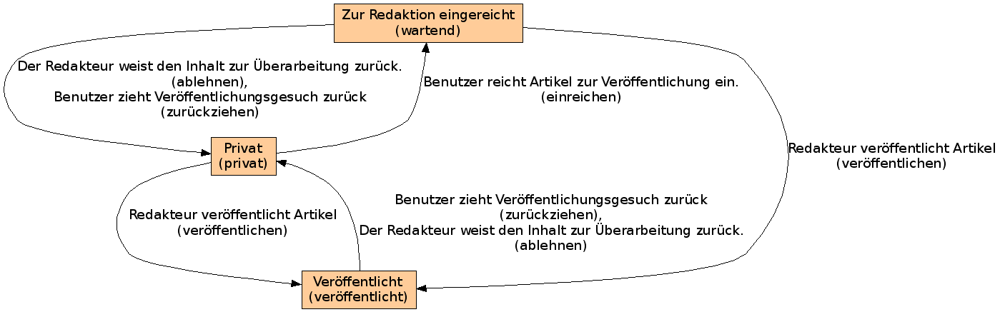

Einfacher Arbeitsablauf
=======================

- Der einfache Arbeitsablauf ist geeignet für einfache Websites.
- Er beginnt mit dem Status *privat*, danach kann ein Artikel *zur Redaktion vorlgelegt* oder direkt *veröffentlicht* werden.

|Einfacher Arbeitsablauf|

Der einfache Arbeitsablauf besteht aus drei Stadien:

#. Privat

   Als Voreinstellung hat ein neu erstellter Artikel den Status *privat* und kann nur von den Rollen betrachtet werden, die die Rollen zum Hinzufügen oder Verwalten von Inhalten haben.

   .. image:: plone4-artikelstatus-privat.png

#. Zur Redaktion eingereicht

   Wenn der Artikel fertig bearbeitet und öffentlich zugänglich werden soll, können Sie ihn zur Veröffentlichung einreichen.

   .. image:: plone4-einfacher-arbeitsablauf-2zur-veroeffentlichung-einreichen-nutzersicht.png

   Ist ein Artikel im Status *Zur Redaktion eingereicht*, wird er  Redakteuren und Verwaltern in einer  Revisionsliste vorgelegt. Diese können dann entscheiden, ob der Artikel veröffentlicht wird.

   .. image:: plone4-einfacher-arbeitsablauf-zur-redaktion-eingereicht.png

   Folgende Übergänge stehen Ihnen in diesem Stadium zur Verfügung:

   Veröffentlichen
    Redakteure und Verwalter können den Artikel veröffentlichen, sodass er anschließend von allen betrachtet werden kann.

    .. image:: spr02.png/image_preview

   Zurückweisen
    Redakteure können den Artikel auch zurückweisen, sodass er wieder in den Status *Privat* zurückgesetzt wird und von Ihnen erneut bearbeitet werden kann.

    .. image:: plone4-artikelstatus-2zur-redaktion-eingereicht-zurueckweisen-redaktionssicht.png

   Zurückziehen
    Falls Sie selbst Ihren Artikel noch einmal bearbeiten möchten, können Sie ihn wieder zurückziehen in den Status *privat*.

    .. image:: plone4-artikelstatus-2zur-redaktion-eingereicht-zurueckziehen-benutzersicht.png

#. Veröffentlicht

   Der Artikel kann von allen betrachtet werden.

   .. image:: plone4-artikelstatus-veroeffentlicht.png

**Anmerkung:** Die Option *Erweitert…* wird in  :doc:`bedienelemente` beschrieben.

.. _`Bedienelemente`: bedienelemente

