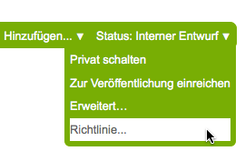
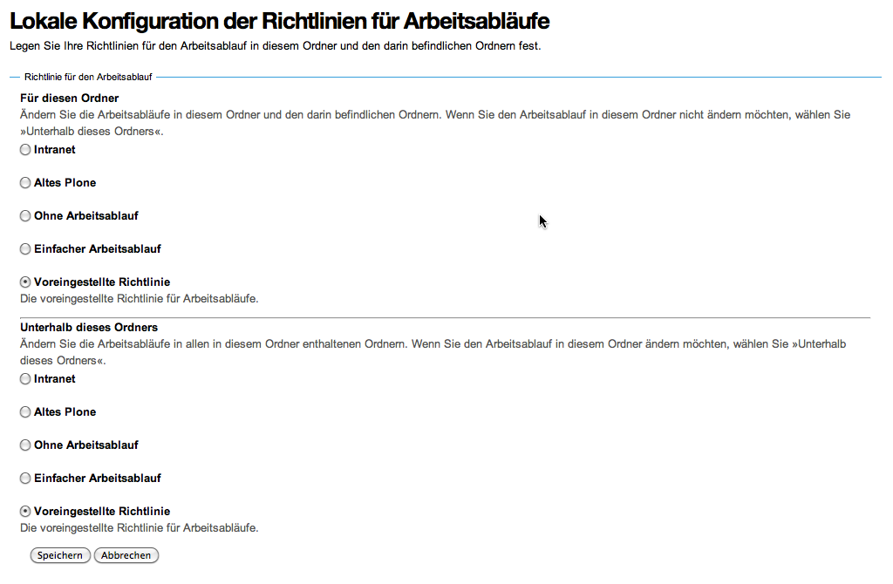

==========
Richtlinie
==========

Sofern der *Workflow Policy Support* installiert ist, können Arbeitsabläufe nicht nur global für die gesamte Website festgelegt werden sondern auch für jeden darin enthaltenen Ordner.

Erreichen können Sie diese Option über das Statusmenü eines Ordners:

Es öffnet sich dann ein Formular, in dem Sie angeben können, welchem Arbeitsablauf der Ordner zugeordnet werden soll und ob dessen Inhalte diesen Arbeitsablauf ebenfalls unterliegen sollen.

