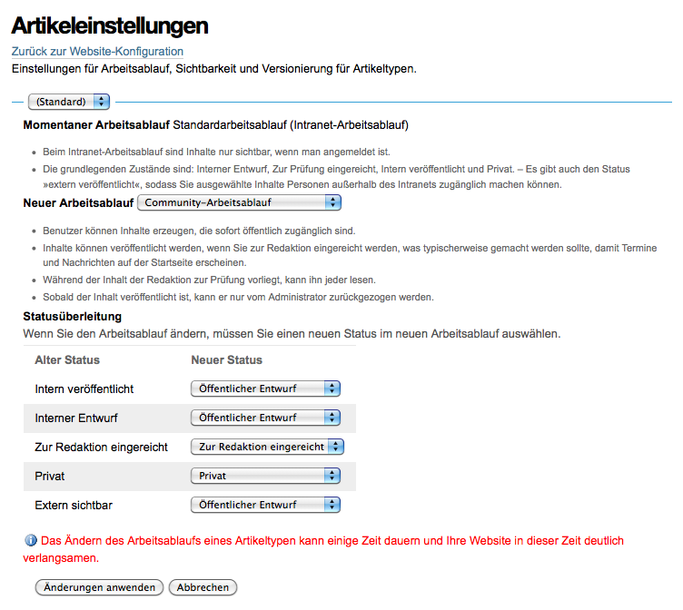

Artikeleinstellungen
====================

Einstellungen für Arbeitsablauf, Sichtbarkeit und Versionierung für Artikeltypen.

Es lässt sich für jeden Artikeltyp oder die Standardartikeltypen ein bestimmter Arbeitsablauf angeben.

Zu den Standardartikeltypen gehören *Bild, Datei, Kollektion, Link, Nachricht, Ordner,Seite* und *Termin*.. 

Der Standard-Arbeitsablauf ist *Einfacher Arbeitsablauf*. 

Arbeitsabläufe
--------------

Mögliche Arbeitsabläufe sind:

- `Community-Arbeitsablauf`_
- Community-Arbeitsablauf für Ordner
- Intranet-Arbeitsablauf für Ordner
- `Intranet-Arbeitsablauf`_
- `Einfacher Arbeitsablauf`_
- `Arbeitsablauf mit einem Zustand`_

.. `Community-Arbeitsablauf`_: ../inhalte-verwalten/arbeitsablaeufe/community-arbeitsablauf
.. `Intranet-Arbeitsablauf`_: ../inhalte-verwalten/arbeitsablaeufe/intranet-arbeitsablauf
.. `Einfacher Arbeitsablauf`_: ../inhalte-verwalten/arbeitsablaeufe/einfacher-arbeitsablauf
..  `Arbeitsablauf mit einem Zustand`_: ../inhalte-verwalten/arbeitsablaeufe/arbeitsablauf-mit-einem-zustand

Darüberhinaus können die Artikeltypen auch keinem Arbeitsablauf zugewiesen werden.

Beim Ändern eines Arbeitsablaufs kann detailliert jedes Stadium des alten Arbeitsablaufs einem Stadium des neuen Arbeitsablaufs zugeordnet werden.

In diesem Fall ändern wir den Arbeitsablauf von einem Community-Arbeitsablauf zu einem Intranet-Arbeitsablauf.

Sie können nun auch bestimmen, welchen Status die Artikel erhalten sollen, deren bisheriger Status nicht erhalten bleiben kann, z.B. werden in folgendem Fall alle Artikel mit dem Status *Öffentlicher Entwurf* in den Status *Interner Entwurf* gesetzt werden.

Bitte vergessen Sie nicht, abschließend noch auf *Änderungen anwenden* zu klicken.

