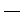

Visueller Editor
================

Visueller HTML-Editor, der in allen aktuellen Browsern ohne zusätzliche Browser-Module funktioniert. 

Wenn Sie z.B. eine Seite, einen Termin oder eine Nachricht bearbeiten, können Sie den Haupttext im allgemeinen mit dem grafischen Editor TinyMCE bearbeiten. Er besitzt eine Leiste mit Funktionen und ein Aufklappmenü mit verschiedenen Formatvorlagen.

|TinyMCE|

Standardfunktionen
------------------

Folgende Funktionen bringt TinyMCE üblicherweise mit:

|Speichern|
 Speichern
|Fett|
 Fett (``Strg-B``)
|Kursiv|
 Kursiv (``Strg-I``)
|Linksbündig|
 Linksbündig
|Zentriert|
 Zentriert
|Rechtsbündig|
 Rechtsbündig
|Blocksatz|
 Blocksatz
|Unnummerierte Liste|
 Unnummerierte Liste
|Nummerierte Liste|
 Nummerierte Liste
|Definitionsliste|
 Definitionsliste
|Ausrücken|
 Ausrücken
|Einrücken|
 Einrücken
|Bild einfügen/verändern|
 Bild einfügen/verändern

 |Bild einfügen|

 In der linken Spalte werden Ihnen einige Verweise angeboten, die Ihnen das Finden von Bildern, die bereits in der Website vorhanden sind, erleichtern sollen:

 Home
  Die oberste Ebene der website
 Current Folder
  Der aktuelle Ordner in dem Sie Ihren Artikel bearbeiten.

 Alternativ können sie auch nach Bildern auf der Website suchen.

 In der mittleren Spalte sehen Sie eine Liste der Bilder des aktuellen Ordners oder der Suchergebnisse. Befindet sich das Bild noch nicht auf der Webssite, können Sie im ausgewählten Ordner auch ein Bild aus Ihrem lokalen Verzeichnis hochladen.

 In der dritten Spalte erhalten sie die Detailinformationen zum ausgewählten Bild:

 Vorschau
  Eine Vorschau des ausgewählten Bildes
 Beschreibung.
  Hier können Sie eine Beschreibung des Bildes eingeben. 
 Ausrichtung
  Hier können Sie auswählen, ob das Bild im Textfluss, linksbündig oder rechtsbündig angeordnet werden soll.
 Alternativer Text
  Dieser ermöglicht es denjenigen, die das Bild nicht oder kaum sehen können, dennoch die Bedeutung des Bildes zu erfassen.
 Ausmaße
  Das Bild kann in einer der folgenden Größen angezeigt werden:

  Original
   zeigt das Bild in der Originalgröße an
  Listing
   max. 16px
  Icon
   max. 32px
  Tile
   max. 64px
  Thumb
   max. 128px
  Mini
   max. 200px
  Preview
   max. 400px
  Large
   max. 768px

 Sie können auch die Angaben für ein bstehendes Bild ändern indem Sie zunächst das Bild markieren und anschließend in das *Bild hinzufügen/verändern*-Icon klicken.

|Link einfügen/verändern|
 Link einfügen/verändern

 Sie können ein Wort oder eine Phrase markieren und anschließend auf das Link-Icon klicken:

 |Link einfügen/bearbeiten allgemein|

 #. In der linken Spalte wird Ihnen eine Liste angezeigt: 

    Home
     Die oberste Ebene der Website
    Current Folder
     Der aktuelle Ordner, in dem Sie Ihren Artikel bearbeiten
    External
     Hier können Sie einen Verweis auf eine externe Website angeben.
    Mail
     Hier können Sie auf eine E-Mail-Adresse verweisen.
    Anchors
     Hier können Sie auf einen Abschnitt derselben Seite verweisen:

     |Anker einfügen|

|Link entfernen|
 Link entfernen
|Anker einfügen/verändern|
 Anker einfügen/verändern

 Mit Ankern können Sie innerhalb Ihres Artikels Punkte markieren, die mit einem Verweis direkt angesprungen werden können:

 |Anker-Fenster|

 Beachten Sie bitte, das der grafische Editor für die Formatvorlagen *Heading* und *Subheading* bereits immer schon Anker einfügt.
 Um auf einen solchen Anker zu verweisen, markieren Sie einen text und klicken anschließend auf das *Link*-Icon. In dem sich nun öffnenden Fenster erhalten Sie in der linken Spalte den Eintrag *Anchors*, der Ihnen dann in der mittleren Spalte eine Liste der verfügbaren Anker dieses Artikels anzeigt:

 |Anker einfügen|

|Tabelle erstellen/bearbeiten|
 Tabelle erstellen/bearbeiten

 *Tabelle erstellen/bearbeiten* öffnet ein Fenster mit einem Formular in dem Sie folgende Angaben machen können:

 Allgemein:

 - Aufklappmenü für die verschiedenen Tabellenformatvorlagen:

   Subdued grid
    |Subdued grid|
   Invisible grid
    |Invisible grid|
   Fancy listing
    |Fancy listing|
   Fancy grid listing
    |Fancy grid listing|
   Fancy vertical listing
    |Fancy vertical listing|

 - Anzahl der Spalten
 - Anzahl der Zeilen
 - Zusammenfassung

   Hier sollte aus Gründen der Barrierefreiheit eine Zusammenfassung der Tabelle eingegeben werden.

 Erweitert:

 - Breite

   Hier kann eine bestimmte Breite der Tabelle angegeben werden. 

   Wird nichts angegeben, wird die Breite automatisch berechnet.
 - Höhe

   Hier kann eine bestimmte Höhe der Tabelle angegeben werden. 

   Wird nichts angegeben, wird die Höhe automatisch berechnet.

 - Ausrichtung

   Hier können sie angeben, ob die Tabelle im Textfluss (*- unbestimmt -*), linksbündig, zentriert oder rechtsbündig angezeigt werden soll.

 - Beschriftung der Tabelle

   Eine Beschreibung der Tablle als Tabellenüberschrift.

 Falls Sie zu einem späteren Zeitpunkt die Angaben ändern möchten, können Sie zunächst in die Tabelle klicken und anschließend auf das Tabellensymbol, in dem sich nun öffnenden Dialogfenster können Sie die Änderungen vornehmen.
 
|Eigenschaften der Zeile|
 Eigenschaften der Zeile

 Hier können Sie die Eigenschaften einer Tabellenzeile festlegen:

 Allgemein:

 - Höhe
 - Vertikale Ausrichtung

   bestimmt die Ausrichtung nebeneinanderstehender Elemente unterschiedlicher Höhe

 Erweitert:

 - Gruppierung

   Hier können Sie unterscheiden zwischen dem Kopf der Tabelle, dessen Inhalt und dessen Fußzeilen 

 - Eigenschaften der Zelle

   Hier können Sie angeben, ob die Veränderungen auf die ausgewählte, ungerade, gerade oder alle Zeilen angewendet werden soll:

|Eigenschaften der Zelle|
 Eigenschaften der Zelle

 Hier können Sie die Eigenschaften einer Tabellenzelle festlegen:

 Allgemein:

 - Breite
 - Höhe
 - Vertikale Ausrichtung

   bestimmt die Ausrichtung nebeneinanderstehender Elemente unterschiedlicher Höhe

 Erweitert:

 - Eigenschaften der Zelle

   Hier können Sie angeben, ob die Veränderungen nur auf die ausgewählte Zelle, die Zeile oder die Tabelle angewendet werden soll.

|Zeile oberhalb einfügen|
 Zeile oberhalb einfügen
|Zeile unterhalb einfügen|
 Zeile unterhalb einfügen
|Zeile löschen|
 Zeile löschen
|Spalte links einfügen|
 Spalte links einfügen
|Spalte rechts einfügen|
 Spalte rechts einfügen
|Spalte löschen|
 Spalte löschen
|Verbundene Zellen trennen|
 Verbundene Zellen trennen

 Hier können Sie zusammengelegte Spalten und Zeilen wieder trennen.

|Zellen verbinden|
 Zellen verbinden

 Hier können Sie angeben, wieviele Spalten und Zeilen zusammengelegt werden sollen.

|HTML Quellcode bearbeiten|
 HTML Quellcode bearbeiten

 Hier können Sie den HTML-Quellcode direkt bearbeiten und angeben, ob automatisch zeilenumbrüche eingefügt werden sollen.

|Vollbildschirm|
 Vollbildschirm

 Hier können Sie den grafischen Editor auf die gesamte Größe des Web-Browser-Fensters vergrößern.

Formatvorlagen
--------------

Absatzformatvorlagen
````````````````````

Normal
 Normale Absatzformatierung
Heading
 Absatzformatierung für Überschriften
Subheading
 Absatzformatierung für Unterüberschriften
Literal
 Absatzformatierung für Zitate
Pull-quote
 Absatzformatierung, die ein Zitat aus dem Kontextherausrückt
Call out
 Herovrgehobener Absatz
Clear floats
 Nach dieser Anweisung wird der folgende Text keine Bilder mehr umfließen

Zeichenformatierungen
`````````````````````

Discreet
 Dezente Absatzformatierung 
Highlight
 Hervorhebung einzelner Zeichen
(remove style)
 entfernt alle Formatierungen im Kontext des Cursors

Druckformate
````````````

Page break
 Beim Ausdruck wird der folgende Absatz auf einer neuen Seite begonnen

Tabellenformatvorlagen
``````````````````````

Plain Cell
 Formatierung für einfache Tabellenzellen
Odd row
 Zeile, im allgemeinen mit transparentem Hintergrund
Even row
 Zeile, im allgemeinen mit Hintergrundfarbe
Heading Cell
 Zelle für Spaltenüberschriften

Zusätzliche Funktionen
----------------------

Folgende weitere Funktionen lassen sich vom Verwalter der Website hinzufügen:

|Ausschneiden|
 Ausschneiden
|Kopieren|
 Kopieren
|Einfügen|
 Einfügen
|Als normalen Text einfügen|
 Als normalen Text einfügen
|Mit Formattierungen (aus Word) einfügen|
 Mit Formattierungen (aus Word) einfügen
|Rückgängig|
 Rückgängig (``Strg-Z``)
|Wiederholen|
 Wiederholen (``Strg-Y``)
|Suchen|
 Suchen
|Suchen/Ersetzen| 
 Suchen/Ersetzen
|Unterstrichen|
 Unterstrichen (``Strg-U``)
|Durchgestrichen|
 Durchgestrichen
|Tiefgestellt|
 Tiefgestellt
|Hochgestellt|
 Hochgestellt
|Textfarbe|
 Textfarbe
|Hintergrundfarbe|
 Hintergrundfarbe
|Multimedia einbetten/bearbeiten|
 Multimedia einbetten/bearbeiten
|Sonderzeichen einfügen|
 Sonderzeichen einfügen
|Trennlinie einfügen|
 Trennlinie einfügen
|Trennlinie|
 Trennlinie
|Datum einfügen|
 Datum einfügen
|Zeit einfügen|
 Zeit einfügen
|Smilies|
 Smilies
|Geschütztes Leerzeichen einfügen|
 Geschütztes Leerzeichen einfügen
|Seitenumbruch einfügen| 
 Seitenumbruch einfügen
|Drucken|
 Drucken
|Vorschau|
 Vorschau
|Formattierungen zurücksetzen|
 Formattierungen zurücksetzen
|Quellcode aufräumen| 
 Quellcode aufräumen
|Hilfslinien und unsichtbare Elemente ein-/ausblenden|
 Hilfslinien und unsichtbare Elemente ein-/ausblenden
|Steuerzeichen an/aus|
 Steuerzeichen an/aus
|Attribute einfügen/bearbeiten|
 Attribute einfügen/bearbeiten 


.. |Nummerierte Liste| image:: nummerierte-liste.png


.. |Subdued grid| image:: subdued-grid.png


.. |Zellen verbinden| image:: zellen-verbinden.png





